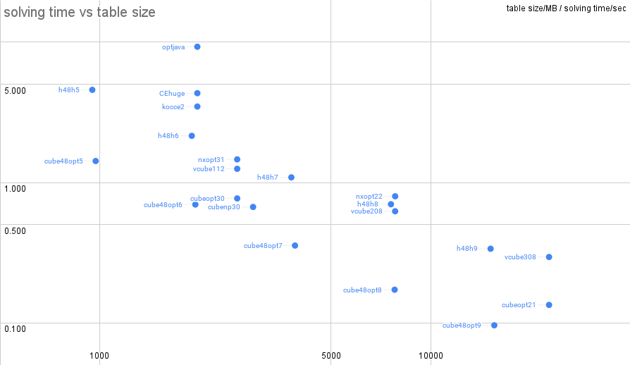

A simple benchmark for Rubik's cube optimal solvers.
Mainly focusing on number of tree-search nodes, pruning-table memory access, solving performance.

# Solvers

| Solver                                                                                     | Language | Variations                                       |
|--------------------------------------------------------------------------------------------|----------|--------------------------------------------------|
| [nxopt](https://github.com/rokicki/cube20src)                                              |   c++    | nxopt11, nxopt21, nxopt31, nxopt22               |
| [vcube](https://github.com/Voltara/vcube/)                                                 |   c++    | vcube104, vcube108, vcube112, vcube208, vcube308 |
| [reid's optimal solver](https://www.cflmath.com/Rubik/optimal_solver.html)                 |    c     | reid                                             |
| [Kociemba's optimal solver](https://github.com/hkociemba/RubiksCube-OptimalSolver)         |  python  | kocpy                                            |
| [Cube Explorer](https://kociemba.org/cube.htm)                                             |  pascal  | CE, CEhuge                                       |
| Open Source [Cube Explorer](https://github.com/cs0x7f/CubeExplorer/tree/fpc)               |  pascal  | kocce0, kocce1, kocce2                           |
| [3ColorCube](https://github.com/mfeather1/3ColorCube)                                      |javascript| 3Color835M, 3ColorOpt                            |
| [stickersolve](https://github.com/TAR-ALEX/stickersolve)                                   |   c++    | sticker                                          |
| [Rubiks-Cube-Optimal-Solver](https://github.com/abdelmaged92/Rubiks-Cube-Optimal-Solver)   |   java   | optjava                                          |
| [nissy-classic](https://github.com/sebastianotronto/nissy-classic)                         |    c     | nissyc                                           |
| [nissy-core](https://github.com/sebastianotronto/nissy-core)                               |    c     | h48h0, h48h1, .., h48h11                         |
| [cubeopt](https://github.com/cs0x7f/cubeopt)                                               |   c++    | cubeopt, cube48opt, cubenp                       |

Detailed Results: https://github.com/cs0x7f/cube_solver_test/wiki

# Brief Results

Left (less memory) and bottom (less solving time per cube) is better.

Platform: Intel Core i7-10750H (6-core 12-thread), transparent hugepage is set to "always"

| Solver     | table/MB | sec/solv | GB*sec |
|------------|----------|----------|--------|
| nxopt31    | 2603.08  |   1.462  |  3.806 |
| nxopt22    | 7809.26  |   0.798  |  6.228 |
| vcube112   | 2603.08  |   1.252  |  3.260 |
| vcube208   | 7809.26  |   0.624  |  4.872 |
| vcube308   | 22777.0  |   0.294  |  6.704 |
| kocce2     | 1972.71  |   3.480  |  6.865 |
| CEhuge[1]  | 1972.71  |   4.333  |  8.548 |
| optjava    | 1972.71  |   9.285  | 18.317 |
| h48h5      | 950.006  |   4.577  |  4.348 |
| h48h6      | 1897.95  |   2.151  |  4.083 |
| h48h7      | 3793.84  |   1.088  |  4.126 |
| h48h8      | 7585.62  |   0.700  |  5.309 |
| h48h9      | 15169.1  |   0.337  |  5.114 |
| cubeopt30  | 2603.08  |   0.770  |  2.004 |
| cubeopt21  | 22777.0  |   0.134  |  3.053 |
| cube48opt5 | 972.840  |   1.423  |  1.384 |
| cube48opt6 | 1945.68  |   0.697  |  1.356 |
| cube48opt7 | 3891.36  |   0.355  |  1.383 |
| cube48opt8 | 7782.72  |   0.172  |  1.339 |
| cube48opt9 | 15565.4  |   0.096  |  1.494 |
| cubenp30   | 2907.46  |   0.669  |  1.946 |

[1] Huge page is not enabled in windows.
